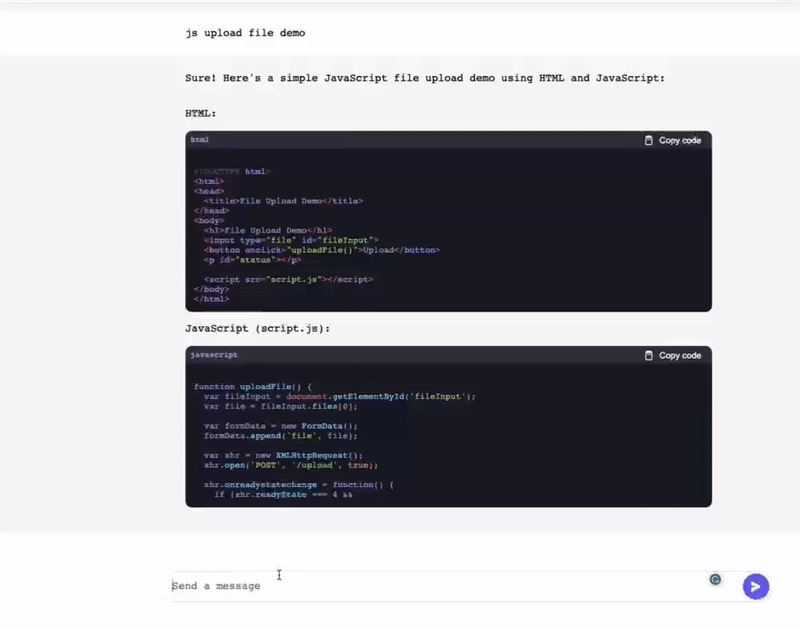

# GPTBot

[GPTBot English Version](../README.md)


该项目基于Tornado框架构建，使用WebSocket实现实时的双向通信。它通过与GPT模型的交互，实现了文本生成的多个功能。

## 功能特点
- 语言翻译：能够进行实时的文本翻译，支持多种语言之间的互译。
- 文本摘要：能够生成长篇文章或段落的摘要或总结，帮助用户快速了解文本内容。
- 问题回答：具备智能问答的功能，可用于构建在线客服系统或知识库系统等，能够回答用户提出的问题。
- 对话生成：能够生成对话内容，可用于构建虚拟助手或聊天机器人等应用。


## 技术栈
GPTBot项目使用以下技术栈和工具：

- Python
- JavaScript
- Tornado
- HTML/CSS
- gpt-3.5模型：用于文本生成的核心模型。
- Redis：为GPTBot应用提供缓存和数据存储功能
- Docker


## 安装和使用

### Docker Compose 方式启动程序
```
docker-compose up
```

### 手动启动

#### 依赖项安装
在使用GPTBot之前，需要安装项目的依赖项。可以使用以下命令安装所需的依赖项：

```
pip install -r requirements.txt
```

#### 配置Redis连接
vim `.env_prod`
```
redis_host=your_redis_host
redis_port=your_redis_port
```


#### 启动
如果您不想使用Docker，也可以使用以下命令手动启动GPTBot：
```
python app.py
```

## Demo1


## Demo2



# 版权和许可
GPTBot基于[MIT许可证](LICENSE)进行许可。详细信息请参阅许可文件。
如有任何问题或建议，请随时提出。感谢您的使用和贡献！